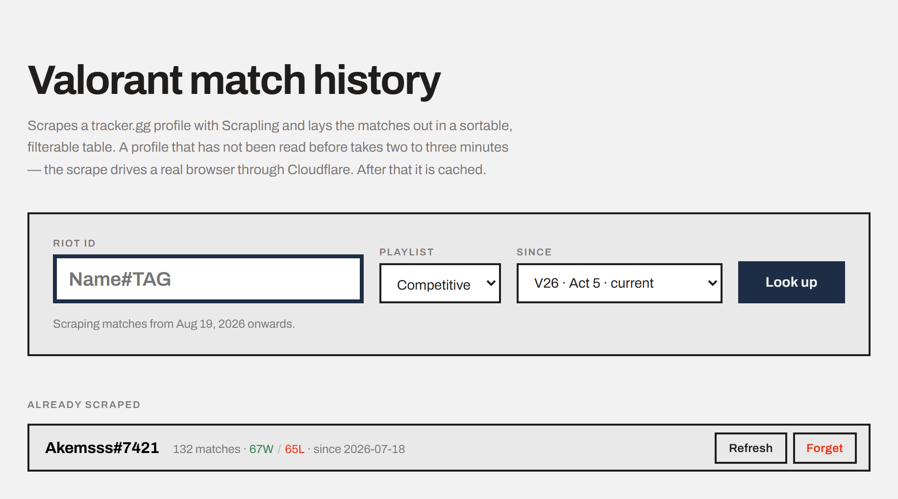
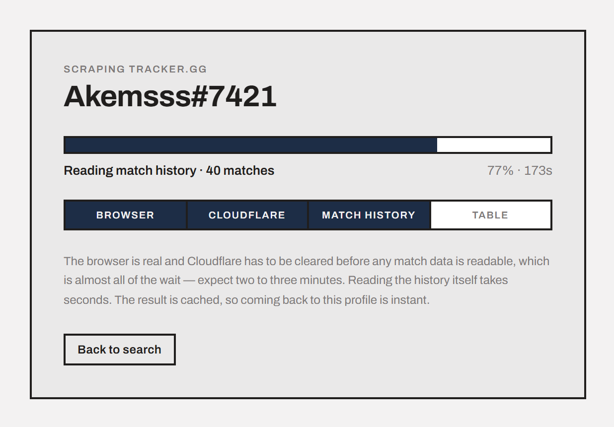
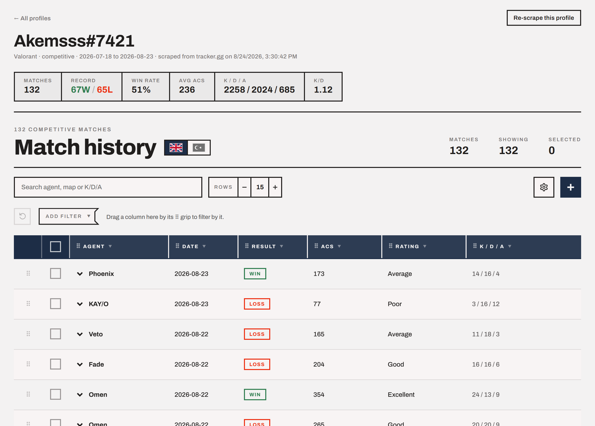

# Valorant Tracker

Look up any Valorant player by Riot ID and read their competitive match history
in a fast, sortable table.

Type a `Name#TAG`, watch it scrape, get the table. Every player you look up is
saved, so going back to one is instant.



## Run it

**Double-click `start.bat`.**

It starts both halves, waits until they answer, and opens the app in your
browser. Two windows appear - one for the scraper, one for the page. Closing
them stops the app.

If something is missing or a port is taken it says so and starts nothing,
rather than half-starting and leaving you to guess.

`Akemsss#7421` is included already scraped, so there is something to look at
straight away.

<details>
<summary>Starting it by hand instead (or on macOS / Linux)</summary>

Two terminals:

```bash
# 1 - the scraper
./.venv/Scripts/python.exe server.py

# 2 - the page
cd DataTableDesign/react
npx vite --port 5180
```

Then open http://localhost:5180/valorant.html - `/valorant.html`, not just `/`,
which shows a generic demo table instead of this app.

To use different ports, set `VT_SERVER_PORT` and `VT_PAGE_PORT`. `start.bat`,
the Vite proxy and the server all read them, so the three stay in agreement.

</details>

### First time only

The two halves each need installing once:

```bash
# the page
cd DataTableDesign/react && npm install

# the scraper (Python 3.10+, from the project folder)
python -m venv .venv
./.venv/Scripts/python.exe -m pip install -e ".[all]"
./.venv/Scripts/scrapling.exe install
```

That last line downloads the browser the scraper drives. On macOS or Linux the
paths are `.venv/bin/` instead of `.venv/Scripts/`.

## What you get

### Search any player

Enter a Riot ID, pick a playlist, and choose how far back to look. Players
you've already looked up are listed underneath — one click reopens them with no
waiting, and there are **Refresh** and **Forget** buttons for each.

### Watch it work



A new player takes **two to three minutes**. Almost all of that is getting past
Cloudflare's bot check; reading the matches themselves takes seconds. The bar
shows which stage it's on and counts matches as they arrive.

You can leave this screen — the scrape keeps going, and the result will be
waiting on the search page.

### Read the results



Totals across the top, then every match: agent, date, result, combat score, a
rating, and kills/deaths/assists. Click the arrow on any row for a detail pane
with the map, rank, round score and accuracy.

The table sorts, searches, filters, reorders rows and columns by dragging, and
exports to CSV. Drag across a run of ACS cells and it shows their average,
highest and total. There's an English/Turkish switch beside the title.

## Good to know

- **Two to three minutes per new player.** That is Cloudflare, not the table.
  Once a player is saved, reopening is instant.
- **One at a time.** The scraper drives a real browser, so a second lookup waits
  until the first finishes.
- **Profiles must be public** on tracker.gg, or there is nothing to read.
- **Reload keeps your place.** The player you're viewing is in the address bar,
  so refreshing and the back button both work.

### If something goes wrong

| | |
|---|---|
| "Cannot reach the scrape server" | The first terminal isn't running. Start `server.py`. |
| "That is not a Riot ID" | It needs the tag: `Name#TAG`, e.g. `Akemsss#7421`. |
| "Port 5180 is already in use" | Something else is on it - often a dev server left running. Close it, or set `VT_PAGE_PORT` to another port. |
| `127.0.0.1` doesn't load | Use `localhost`. Add `--host 127.0.0.1` if you need the IP. |
| `ERROR: No Cloudflare challenge found` | Not an error. It means there was nothing to solve. |

## Command line

The scraper also works on its own, without the page:

```bash
./.venv/Scripts/python.exe scrape_tracker.py --player "Akemsss#7421" --since 2026-07-18
```

It writes `matches.json` and prints a summary.

## What's in here

```
start.bat                            starts both halves and opens the app
server.py                            the scrape API the page talks to
scrape_tracker.py                    the scraper itself
matches.json                         a saved scrape, used to seed the app
profiles/                            saved players (created as you go)
DataTableDesign/                     the table, from a separate project
  react/src/valorant/                this app: search, loading, table
scrapling/                           Scrapling, the scraping library
```

Built with [Scrapling](https://github.com/D4Vinci/Scrapling) and the table from
[DataTableDesign](https://github.com/AbstractJosh/DataTableDesign).

For how any of it actually works — the API, the progress bar, the scraping
gotchas — see [NOTES.md](NOTES.md).
